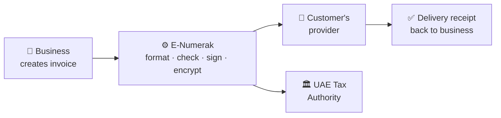
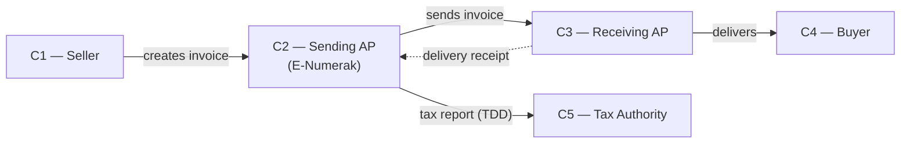
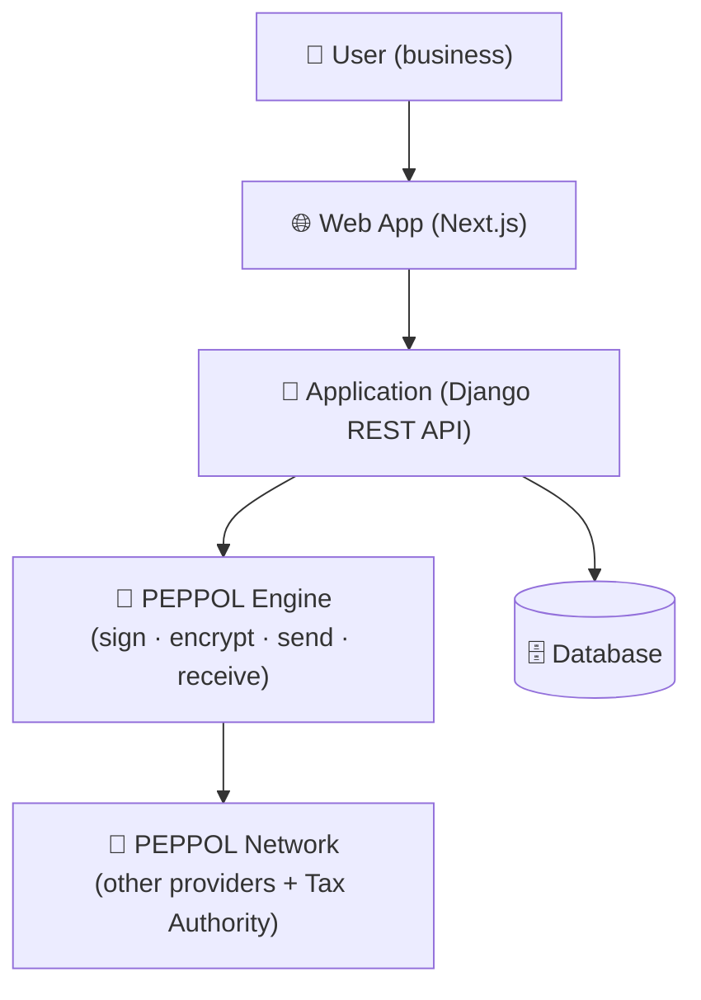
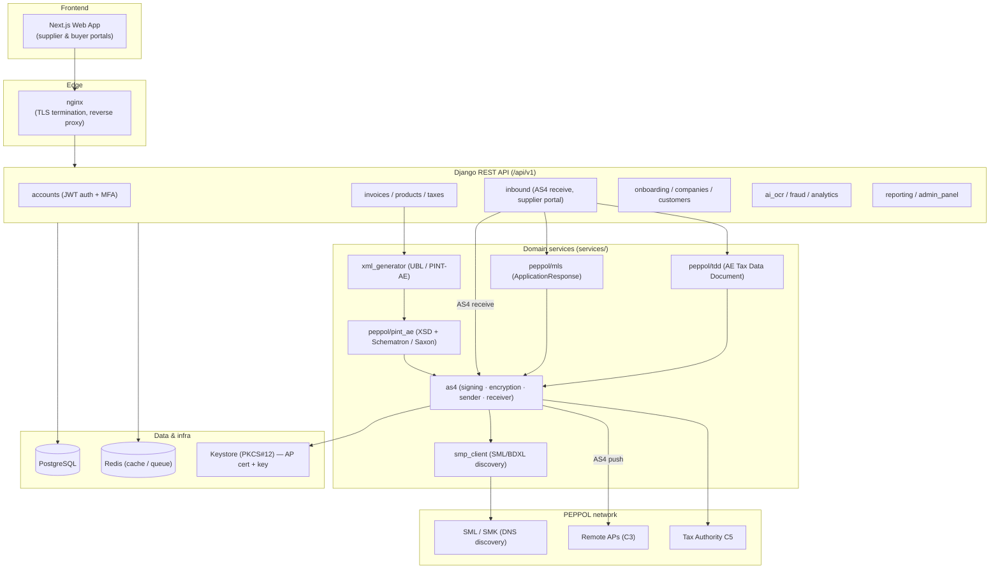

# System Architecture

**Document:** E-Numerak — System Architecture (UAE PEPPOL e-invoicing)
**Service Provider:** AL MERAK TAX CONSULTANT L.L.C
**Participant ID:** 0235:104132266800003
**Inbound address:** https://api.e-numerak.com/api/v1/inbound/as4/
**Date:** 2026-06-20

---

## 1. What E-Numerak does (in simple words)

E-Numerak lets a UAE business **create an invoice, send it electronically to its
customer, and report it to the Tax Authority — automatically and securely.**

Think of it like sending a **registered, sealed letter**:

1. The business types the invoice into our web app.
2. Our system turns it into the official UAE e-invoice format and checks it for
   errors.
3. It **seals it (encrypts), signs it**, and delivers it to the customer's
   provider over the PEPPOL network.
4. At the same time it sends a **tax report** to the UAE Tax Authority.
5. The customer's side sends back a **delivery receipt**.

The business never sees any of this complexity — they just click "Send".

---

## 2. The PEPPOL "5-corner" model (UAE)

PEPPOL connects everyone through a standard network so any sender can reach any
receiver — like email, but for invoices. The UAE adds one extra step: a copy of
the invoice data (a **Tax Data Document / TDD**) is reported to the Tax Authority.
This is called the **5-corner model**.

| Corner | Who | E-Numerak's role |
|--------|-----|------------------|
| **C1** | The seller (our customer's business) | — |
| **C2** | The seller's Access Point | **✅ E-Numerak (we send)** |
| **C3** | The buyer's Access Point | **✅ E-Numerak (we receive)** |
| **C4** | The buyer's business | — |
| **C5** | UAE Tax Authority | We report the TDD to it |

---

## 3. The building blocks (overview)

Our platform has three simple layers:

| Layer | What it is | Plain meaning |
|-------|-----------|---------------|
| **Web app** | Next.js front-end | The screens the user clicks on |
| **Application** | Django REST API | The "brain" — rules, validation, sending |
| **PEPPOL engine** | AS4 / SMP / TDD services | The secure postal service to the network |
| **Storage** | PostgreSQL + Redis | Where data and temporary jobs are kept |

---

## 4. Detailed technical architecture

The following is the full technical view for reviewers who need component-level
detail.

### 4.1 Sending an invoice (step by step)
1. Supplier creates an invoice (`POST /api/v1/invoices/`).
2. On submit, the system builds the **PINT-AE UBL** document.
3. It is validated against **XSD + Schematron** — invalid invoices are **stopped
   before sending**.
4. The receiver's address + certificate are looked up via **SML/SMP**.
5. The receiver's certificate is trust-checked (chain + revocation).
6. The message is **signed + encrypted** and pushed over AS4 (TLS).
7. A delivery **Receipt**, then an **MLS** status, come back.
8. A **Tax Data Document (TDD)** is reported to the Tax Authority (C5).

### 4.2 Receiving an invoice (step by step)
1. A remote provider pushes a message to `/api/v1/inbound/as4/`.
2. We verify the signature, check the sender is trusted, and decrypt.
3. The document is validated and stored.
4. We return an **MLS** (accepted / rejected) to the sender.
5. The corresponding **TDD** is reported to C5.

---

## 5. Security at a glance

| Protection | How |
|------------|-----|
| Connection | HTTPS / TLS |
| Tamper-proof | Digital signature (RSA-SHA256) |
| Confidential | Payload encrypted (AES-128-GCM + RSA-OAEP) |
| Identity | PEPPOL X.509 certificate |
| Trust | Every certificate is chain + revocation checked |

Full detail: [05-security-encryption-policy.md](05-security-encryption-policy.md).
Data model: [06-er-diagram.md](06-er-diagram.md).

---

## 6. Where it runs

- **Hosting:** Linux server (Docker containers: web API, database, cache, nginx).
- **Data residency:** hosted for UAE operations (see Hosting / Data Residency doc).
- **Keys:** the PEPPOL certificate + private key live in a password-protected
  keystore, loaded only by the application — never exposed to users.
