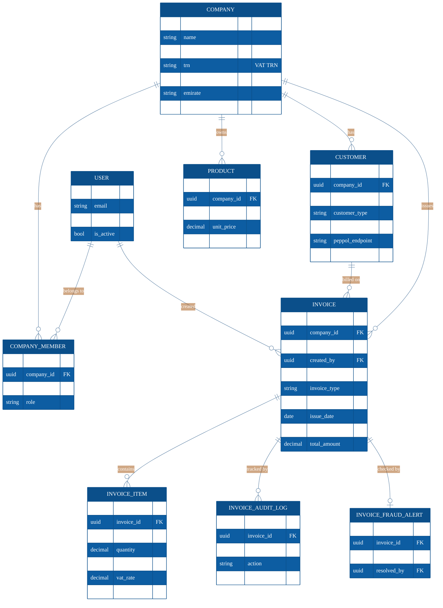
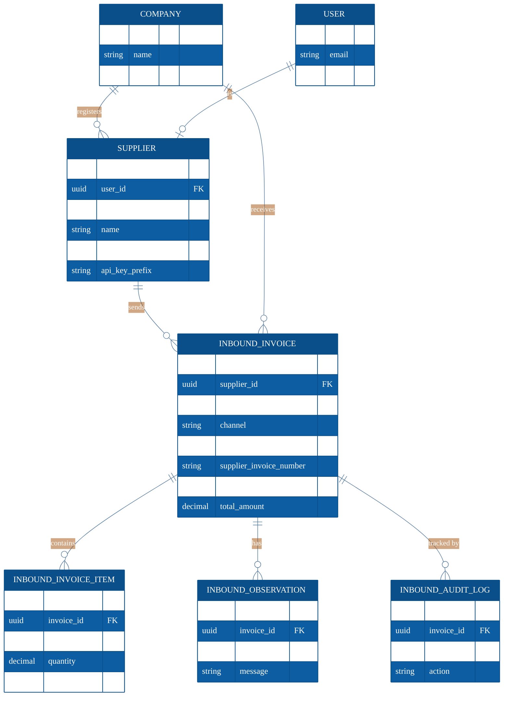

# Database ER Diagram

**Document:** E-Numerak — Entity Relationship Diagram (core data model)
**Service Provider:** AL MERAK TAX CONSULTANT L.L.C
**Date:** 2026-06-20

---

## 1. In simple words

This diagram shows **what information the system stores and how it is linked**.

- A **Company** (the seller/business) has **users**, **customers**, **products**,
  and the **invoices** it sends.
- Each **Invoice** belongs to one company and one customer, and has many
  **line items**, an **audit trail**, and an optional **fraud check**.
- For invoices **received** from other businesses, a **Supplier** sends an
  **Inbound Invoice** to a receiving company.

Only the **core** tables are shown for clarity (the platform has more supporting
tables for auth tokens, reporting, etc.).

---

## 2. Identity & Outbound (Sales) data model

How users, companies, customers, products and **outgoing invoices** relate.

---

## 3. Inbound (Purchase) data model

How **suppliers** and **received invoices** relate to the receiving company.

---

## 4. Relationship legend

| Symbol | Meaning |
|--------|---------|
| `||--o{` | one-to-many (e.g. one Company → many Invoices) |
| `||--o|` | one-to-one / optional (e.g. one Invoice → at most one Fraud Alert) |
| `PK` | primary key (UUID) |
| `FK` | foreign key (link to another table) |

---

## 5. Key relationships in plain terms

- **User ↔ Company** is many-to-many through **Company Member** (a user can belong
  to several companies; a company can have several users, each with a role).
- **Outbound side:** Company → Customer → **Invoice** → Invoice Items
  (+ audit log + optional fraud alert).
- **Inbound side:** a **Supplier** (linked to a login user) sends an
  **Inbound Invoice** to a receiving Company, with its own items, observations and
  audit log.
- All primary keys are **UUIDs**; money fields use exact **decimal** values
  (no floating-point rounding).
